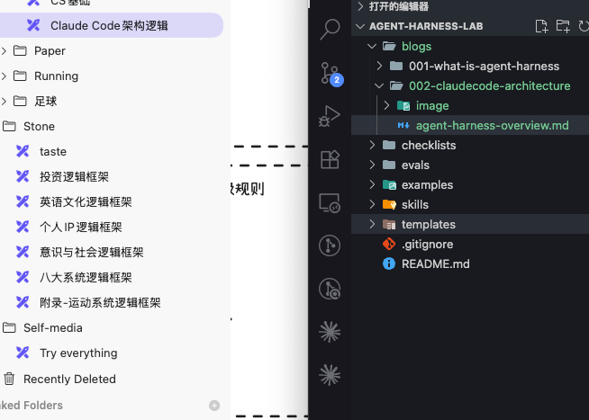
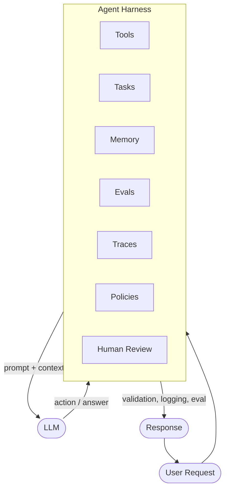

从 2022 年末 ChatGPT 横空出世，到 2026 年 Agent 大爆发，作为一名博士生，深刻体验到了这一轮 AI 热浪对工作范式乃至生活范式的巨大变革。

下面这张图给出了我心中比较完整的 Agent Harness 抽象：

## Agent

我更想把 Agent 定义为一个循环的事件流，比较自然的抽象就是 async generator（异步生成器）。

- **Skill** 进入 prompt。
- **Plugin** 进入 tools。

模型要执行 bash，必须走 tool call。

## Plugin

什么叫插件？插件就是多个 skill + slash commands + subagents + hooks + MCP servers，任意组合。

Plugin 本身不被"调用"，它只是把内部的 skills/commands 安装到你的 Claude Code 环境里，然后由对应机制触发。

## Diagram

*（草稿，后续会补全各模块在 Claude Code 中的具体实现路径。）*
