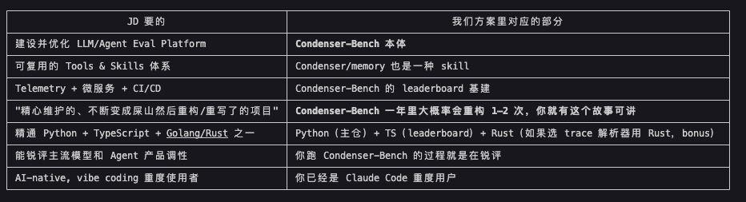
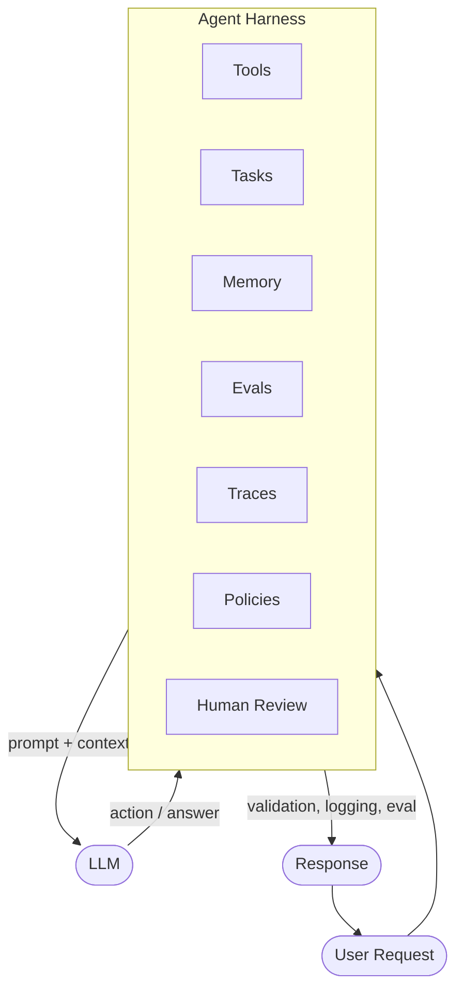

现在出去找工作，基本上都是 Agent Harness + Eval + Memory + Skills 这四件套。

巧的是，这条 JD 几乎是为我们的方案量身定做的：

A short field guide to the engineering layer that surrounds an LLM agent in production.

## The problem

Agent demos are easy. Glue an LLM to a couple of tools, hand-write a prompt, and you have something that looks impressive in a screenshot.

Production agents are hard. The same agent, run a thousand times against real users, leaks context, makes unsafe tool calls, can't be debugged, and silently regresses with every model update.

Most of the work that closes that gap is *not* prompt engineering. It is the **harness**.

## Definition

An **Agent Harness** is the engineering layer around an LLM agent — everything that is not the model itself, but without which the model cannot be operated reliably.

If the LLM is the engine, the harness is the chassis, fuel system, brakes, and dashboard.

## Diagram

## Core components

- **Tool System** — registry, schemas, argument validation, capability scoping, retries.
- **Task System** — long-running work, retries, cancellation, idempotency, dependencies.
- **Context / Memory** — what the model sees, what is remembered across turns, what is forgotten.
- **Eval Harness** — replayable scenarios, regression tests, scoring rubrics.
- **Observability** — traces, spans, token accounting, tool-call inspection, replay.
- **Reliability Controls** — rate limits, circuit breakers, sandboxing, cost caps.
- **Human-in-the-loop** — approval gates, escalation paths, audit logs.
- **CI/CD Quality Gates** — evals run on every change, before any model or prompt ships.

## Why it matters

The model gets the headlines. The harness gets the pager. Teams that treat the harness as a first-class system — versioned, tested, observable — ship agents that survive contact with users. Teams that don't, ship demos.
